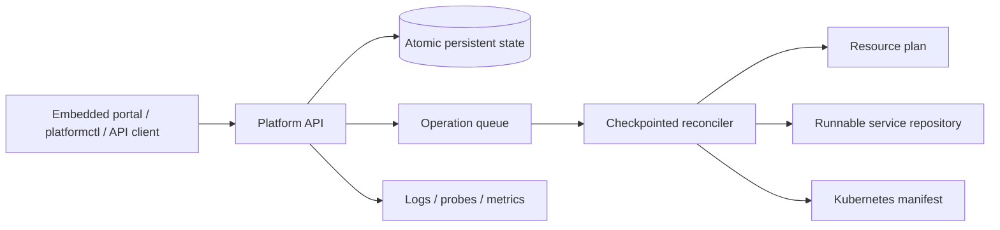

# Internal Developer Platform

[](https://github.com/QihuiPan/internal-developer-platform/actions/workflows/ci.yml)
[](https://github.com/QihuiPan/internal-developer-platform/releases/latest)
[](LICENSE)

A self-contained developer platform starter that turns a service descriptor into durable desired state, a tracked asynchronous operation, and a runnable service repository with CI and Kubernetes deployment assets.

It is designed to be cloned and used immediately on a laptop, in Docker Compose, or on a single-replica Kubernetes installation. No database or cloud account is required for the local golden path.

## Start in two minutes

### Docker Compose

Requirements: Docker with Compose v2.

```bash
git clone https://github.com/QihuiPan/internal-developer-platform.git
cd internal-developer-platform
docker compose up --build
```

Open [http://127.0.0.1:8080](http://127.0.0.1:8080), create the example service, and watch all reconciliation steps complete. Compose binds only to loopback by default. State and generated repositories remain in the `platform-data` Docker volume.

### Prebuilt release

Download the archive for Windows, macOS, or Linux from [GitHub Releases](https://github.com/QihuiPan/internal-developer-platform/releases/latest), extract it, then run:

```bash
./platform-api
```

Open [http://127.0.0.1:8080](http://127.0.0.1:8080). On Windows, run `platform-api.exe`. Every release includes SHA-256 checksums.

### Source checkout

Requirements: Go 1.26 or newer.

```bash
go test ./...
go run ./cmd/platform-api
```

In another terminal:

```bash
go run ./cmd/platformctl create --file examples/payments-notifier.json
go run ./cmd/platformctl list
```

The generated repository is written to `.platform/generated/payments-notifier` and includes a runnable service, non-root container image, CI workflow, ownership file, service descriptor, and Kubernetes resources.

## Included user workflows

- Create a Go, Python, or Node HTTP service from the browser, CLI, or API.
- Follow validation, planning, rendering, and verification in real time.
- List catalogue entries and operation history after a restart.
- Download every ready generated repository as a ZIP from the browser, CLI, or API.
- Retry a failed operation from its last completed checkpoint with an audit reason.
- Run the generated service directly, build its image, or adapt its Kubernetes manifest.
- Protect a shared starter deployment with a Bearer token and a server-assigned RBAC role.

Useful CLI commands:

```bash
platformctl create --name orders-api --owner team-orders --template go-http@1.0.0
platformctl list
platformctl get orders-api
platformctl download orders-api
platformctl operations
platformctl operation OPERATION_ID
platformctl retry --reason "Storage is available again" OPERATION_ID
platformctl audit --role platform_admin
```

All commands support `--address`, `--actor`, `--role`, and `--token`. Environment equivalents are documented in [Configuration](docs/configuration.md).

## Architecture



The downloadable binary embeds the portal and worker, so there is only one process to operate. The runtime store is intentionally single-replica; PostgreSQL, GitHub App, Terraform, and Argo CD integration points are documented production-evolution seams, not simulated cloud actions.

## Authentication

The default `demo` mode is zero-configuration and binds to `127.0.0.1`. It uses explicit `X-Actor` and `X-Role` headers to make RBAC behavior visible. Do not expose demo mode to an untrusted network.

Use `token` mode for a shared starter instance:

```bash
export PLATFORM_AUTH_MODE=token
export PLATFORM_AUTH_ROLE=platform_admin
export PLATFORM_API_TOKEN='replace-with-at-least-16-random-characters'
./platform-api --address 0.0.0.0:8080
```

The configured role is assigned by the server and cannot be elevated by a request header. For internet-facing or multi-team production use, replace this bootstrap mechanism with verified OIDC claims as described in the [threat model](docs/threat-model.md).

| Role | Create | Read | Retry | Audit |
| --- | :---: | :---: | :---: | :---: |
| `developer` | Yes | Yes | Yes | No |
| `service_owner` | Yes | Yes | Yes | No |
| `platform_admin` | Yes | Yes | Yes | Yes |
| `auditor` | No | Yes | No | Yes |

## Kubernetes

The Helm chart is single-replica because the included atomic file store has one writer. For a protected installation:

```bash
kubectl create namespace platform-system
kubectl -n platform-system create secret generic platform-api-auth --from-literal=token='replace-with-a-random-secret'
helm upgrade --install idp deploy/helm/platform-api \
  --namespace platform-system \
  --set auth.mode=token \
  --set auth.existingSecret=platform-api-auth
```

The chart enables a non-root security context, read-only root filesystem, probes, resource limits, persistent storage, and a NetworkPolicy. Set `image.repository` and an immutable `image.digest` for your registry before a production-shaped install.

## API example

```bash
curl http://127.0.0.1:8080/v1/services \
  -H 'Content-Type: application/json' \
  -H 'Idempotency-Key: demo-payments-001' \
  -H 'X-Actor: alice' \
  -H 'X-Role: developer' \
  --data @examples/payments-notifier.json
```

Repeat the same request and key to receive the original operation. Reusing the key with a different descriptor returns `409 IDEMPOTENCY_CONFLICT`. See the [OpenAPI contract](api/openapi.yaml).

## Verification

```bash
make verify
.github/scripts/smoke-test.sh
docker build -t platform-api:local .
helm lint deploy/helm/platform-api
terraform fmt -check -recursive terraform
```

CI runs unit, integration, resilience, race, smoke, container, Terraform, and Helm checks. Tagged releases cross-compile both binaries for Windows, macOS, and Linux on AMD64 and ARM64.

## Repository map

```text
cmd/                    API and CLI entry points
web/                    Embedded dependency-free portal
internal/api/           HTTP contract, authentication, RBAC, metrics
internal/domain/        Descriptor, state machine, validation
internal/operations/    Checkpointed worker and service renderer
internal/store/         Durable atomic starter store
api/                    OpenAPI contract
deploy/helm/            Kubernetes packaging
terraform/              Environment provisioning baseline
policies/kyverno/       Workload admission policy
migrations/             PostgreSQL production schema target
docs/                   Setup, operations, architecture, and evidence
```

## Deliberate boundaries

This release is directly usable as a local or small shared platform starter. It is not a hosted multi-tenant platform: the included store supports one API replica, generated repository links are local filesystem URLs, and authenticated GitHub/Terraform/Argo/Grafana mutations require organization-specific adapters and credentials. These limits are explicit so users never mistake generated local evidence for completed cloud changes.

Read [Getting Started](docs/getting-started.md), [Configuration](docs/configuration.md), [Troubleshooting](docs/troubleshooting.md), [Architecture](docs/architecture.md), [SLOs](docs/slos.md), and the [operation runbook](docs/runbooks/operation-failure.md).

## Contributing and security

Every code, configuration, documentation, or infrastructure change must include an English entry in [CHANGELOG.md](CHANGELOG.md). See [CONTRIBUTING.md](CONTRIBUTING.md) and [SECURITY.md](SECURITY.md).

Licensed under the [MIT License](LICENSE).
