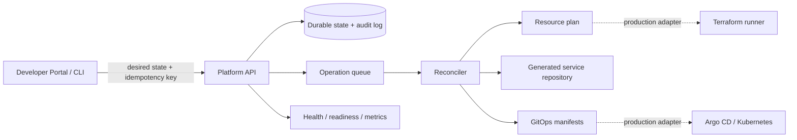

# Internal Developer Platform

[](https://github.com/QihuiPan/internal-developer-platform/actions/workflows/ci.yml)

A self-service control plane that turns a versioned service descriptor into durable desired state, a tracked asynchronous operation, a secure service repository, and a GitOps deployment manifest.

This repository is an implementation-focused portfolio MVP. It emphasizes the difficult platform concerns—idempotency, reconciliation, checkpoints, authorization, auditability, secure defaults, and actionable operation state—rather than presenting a portal that hides failures.

## What works

- `POST /v1/services` validates a versioned descriptor and requires an idempotency key.
- A durable local state store commits service, operation, idempotency, and audit records together.
- A background processor checkpoints validation, planning, repository rendering, and verification.
- A retry resumes a failed operation without repeating completed steps.
- Versioned Go, Python, and Node HTTP templates generate health, readiness, metrics, CI, CODEOWNERS, a non-root image, Kubernetes probes, resource limits, and default-deny networking.
- RBAC separates developer, service-owner, platform-admin, and auditor actions.
- The portal displays live operation progress without requiring worker-log access.
- Helm, Terraform, Kyverno, OpenAPI, PostgreSQL migration, CI, ADRs, a threat model, and a runbook provide production-shaped seams.

## Architecture



The demo runs one API process and one embedded worker. Boundaries in `internal/store` and `internal/operations` are deliberately small so the durable store, queue, GitHub, Terraform, and Argo implementations can be replaced independently.

## Quick start

### Go

Requirements: Go 1.26 or newer.

```bash
go test ./...
go run ./cmd/platform-api
```

In another terminal:

```bash
go run ./cmd/platformctl -name payments-notifier -owner team-payments
```

The generated repository appears under `.platform/generated/payments-notifier`. Inspect the operation through the URL returned in the create response.

### Docker Compose

```bash
docker compose up --build
```

Open `http://localhost:3000`, submit the default service, and watch the operation advance through its checkpoints. The API is available at `http://localhost:8080`.

### Direct API request

```bash
curl -i http://localhost:8080/v1/services \
  -H 'Content-Type: application/json' \
  -H 'Idempotency-Key: demo-payments-001' \
  -H 'X-Actor: alice' \
  -H 'X-Role: developer' \
  --data @examples/payments-notifier.json
```

Repeat the same request with the same key to receive the original operation. Reuse that key with a different descriptor to receive `409 IDEMPOTENCY_CONFLICT`.

## Operation model

```text
PENDING -> VALIDATING -> PLANNING -> APPLYING -> VERIFYING -> SUCCEEDED
               |             |           |
               +---------- FAILED <------+
                              |
                           RETRYING
```

Each step records its attempt count and timestamps. Set `PLATFORM_FAIL_AT_STEP=render` to exercise failure handling, remove the failpoint, then call `POST /v1/operations/{id}/retry` with a reason. Completed steps remain complete.

## Identity and authorization

The demonstrator uses explicit `X-Actor` and `X-Role` headers so RBAC behavior is visible and testable without an identity provider. This adapter is intentionally fail-closed: missing identity headers are rejected. Replace it with verified OIDC claims before any shared or production deployment; never expose the current adapter to an untrusted network.

| Role | Create service | Read service / operation | Retry | Read audit events |
| --- | :---: | :---: | :---: | :---: |
| Developer | Yes | Yes | Yes | No |
| Service owner | Yes | Yes | Yes | No |
| Platform admin | Yes | Yes | Yes | Yes |
| Auditor | No | Yes | No | Yes |

## Repository map

```text
cmd/                    API and CLI entry points
internal/api/           HTTP contract, RBAC enforcement, metrics
internal/domain/        Descriptor, operation state, validation
internal/operations/    Checkpointed reconciler and golden-path renderer
internal/store/         Durable, atomic demo state store
portal/                 Dependency-free self-service UI
api/                    OpenAPI contract
deploy/helm/            Secure Kubernetes packaging
policies/kyverno/       Admission policy for workload defaults
terraform/              Environment provisioning module and dev example
migrations/             PostgreSQL production schema target
docs/                   ADRs, threat model, runbook, SLOs, test evidence
```

## Verification

```bash
go test -race -cover ./...
go vet ./...
go test -run '^$' -bench . -benchmem ./internal/...
```

CI also builds both binaries, checks portal JavaScript, validates Terraform formatting, lints the Helm chart, and requires every pull request to update `CHANGELOG.md`.

## Completion matrix

| Blueprint outcome | Evidence | Status |
| --- | --- | --- |
| Versioned service descriptor | Domain validation, OpenAPI, JSON example | Complete |
| Retry-safe control plane | Request fingerprint, durable checkpoints, replay tests | Complete for single worker |
| Repository and CI generation | Reconciler renderer and end-to-end tests | Complete using filesystem adapter |
| GitOps delivery | Secure manifest generation and Helm packaging | Adapter boundary complete; Argo API integration pending |
| Resource provisioning | Deterministic plan artefact and Terraform namespace module | Dev baseline; managed PostgreSQL/Redis providers pending |
| Security defaults | RBAC, audit trail, OIDC design, Kyverno, hardened containers | MVP complete |
| Observability | Structured logs, probes, Prometheus endpoint, SLO document | MVP complete; distributed tracing pending |
| Failure recovery | Fault injection and checkpoint retry test | Complete |
| PostgreSQL state | Production schema migration | Schema complete; runtime adapter pending |

## Trade-offs and limitations

- The local MVP stores state in one atomically replaced JSON file and therefore supports one active API replica. The PostgreSQL schema shows the multi-replica target, including leases and an outbox, but is not wired into the runtime yet.
- GitHub, Terraform, Argo CD, External Secrets, and Grafana links are adapter outputs rather than authenticated remote mutations. This keeps the repository runnable without cloud credentials and makes incomplete integration explicit.
- The generated repository URL is a local `file://` URL. A GitHub App adapter should create the repository from the recorded immutable template version and apply branch protection.
- The portal is a dependency-free proof of the golden path, not a production Backstage replacement.
- Metrics are intentionally low-cardinality. OpenTelemetry propagation across future adapters remains follow-up work.

See [architecture](docs/architecture.md), [SLOs](docs/slos.md), [threat model](docs/threat-model.md), [operation runbook](docs/runbooks/operation-failure.md), [test evidence](docs/test-evidence.md), and [benchmark evidence](docs/benchmarks.md).

## Change policy

Every code, configuration, documentation, or infrastructure change must include an English entry in `CHANGELOG.md`. CI enforces this on pull requests. See [CONTRIBUTING.md](CONTRIBUTING.md).

## License

MIT
